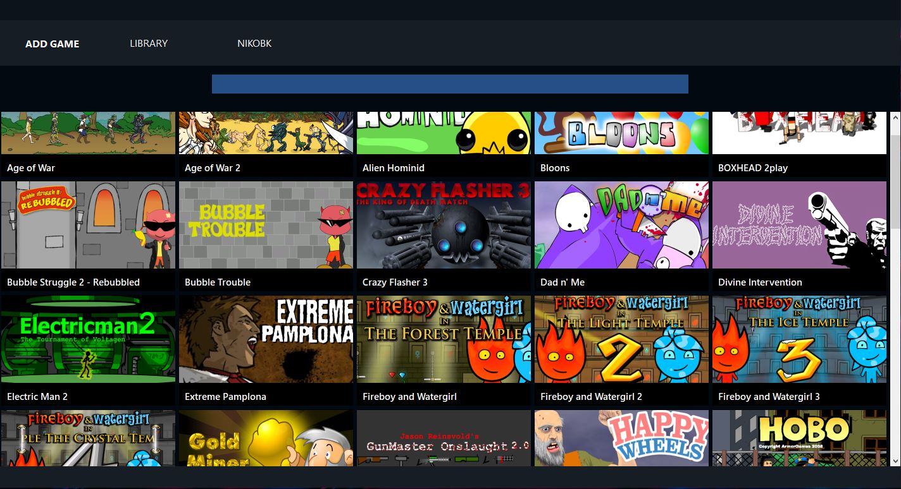
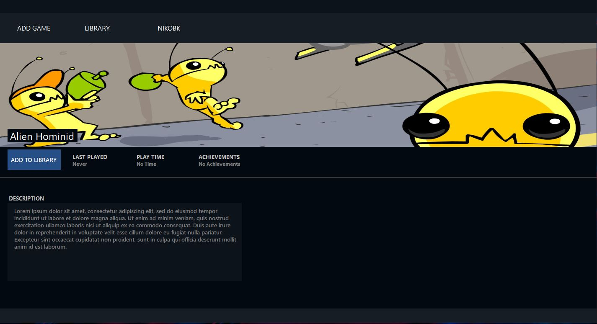
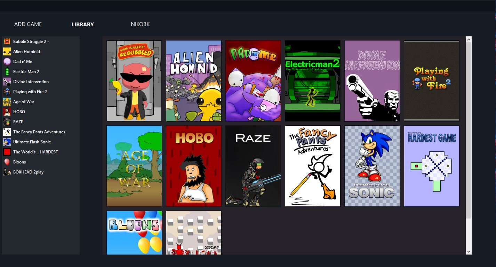
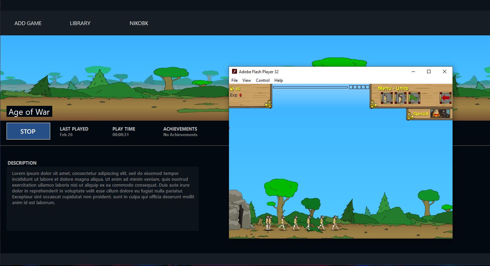

# Flashback

Flashback is a Steam clone I made for fun to revisit Windows Forms.
It aims to organize Flashplayer games run and launched with a Flashplayer Projector locally instead of using Ruffle.

# How to Install
Make a folder named 'Flashback' in your documents directory (it must be the documents!).
Unpack the `bin` folder downloaded from the latest release into the `Flashplayer` folder so that there is a `bin` folder within it.
Drop the `flashplayer_projector.exe` in the `Flashplayer` directory. Make a folder called `Games` in the `Flashback` folder and start Flashback up.

Unfortunately as it is right now games have to be added locally and manually however I am planning on changing this later so it's cloud. If you do not want to go out and find
the games right now this is not for you, I might find a way to share my gamepack of flash games seen on the screenshots above in the future but until then this will have to do.

# Screenshots

---

---

---

# Credits
Application Name by: LilFrozone
